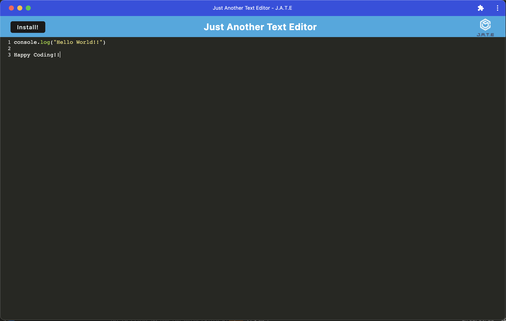
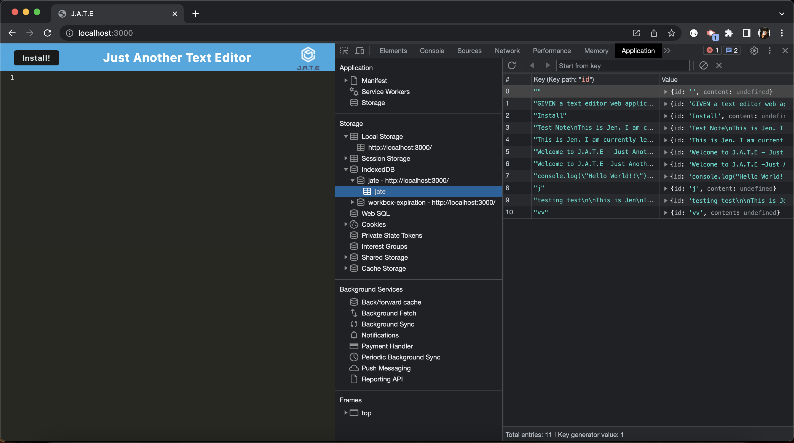
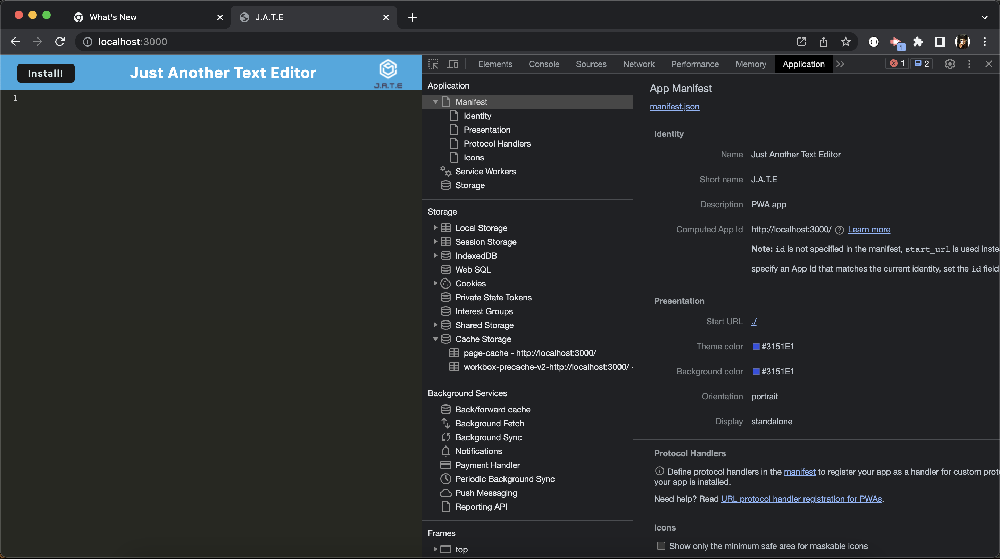
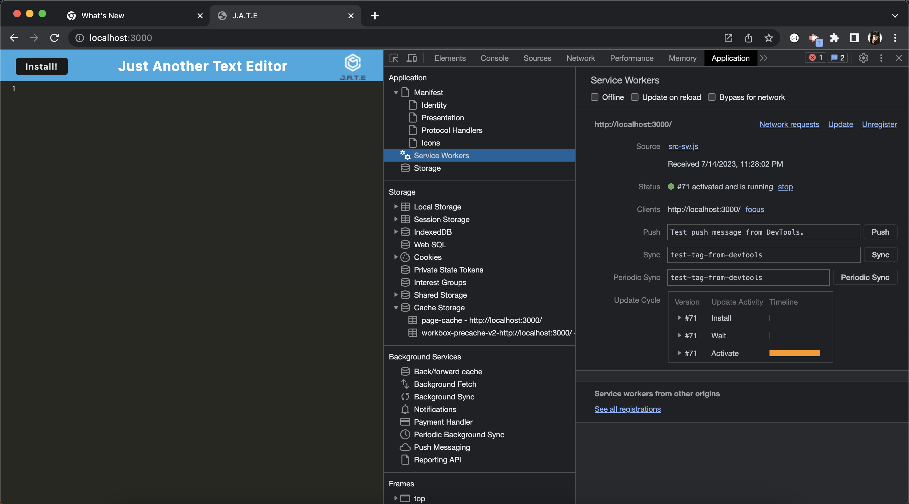
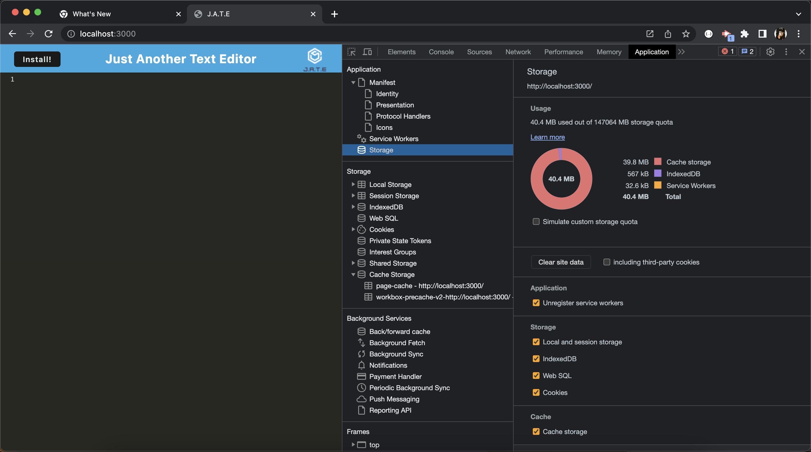

# J.A.T.E - Just Another Text Editor

## Description

J.A.T.E is a Progressive Web Application (PWA) that enables users to create and manage notes seamlessly, even when they are offline. With J.A.T.E, users can easily write, save, and retrieve their text content without requiring an internet connection.  
J.A.T.E leverages the power of IndexedDB to store users' text contents locally, allowing them to access their notes even when they are offline. 

## Table of Contents

- [Installation](#installation)
- [Usage](#usage)
- [Contributing](#contributing)
- [Tests](#tests)
- [License](#license)
- [Questions](#questions)

## Installation

To set up the development environment and run J.A.T.E locally:

1. Clone or download the repository to your device.
2. Make sure you have Node.js installed. If not, you can download it from the official website and install version 18.15.0 or above.
3. Open a terminal or command prompt and navigate to the project directory.
4. Install the required packages by running the command `npm install`.
5. Once the installation is complete, start the server by running `npm run start:dev` in the terminal. You can refer to the package.json file for more available commands.
6. Open your web browser and go to `http://localhost:3000` to access the application.

## Usage

To use J.A.T.E and create/manage your notes:

1. Visit  to access the J.A.T.E application.
2. Optionally, you can choose to download the application for easier access on your device.

## License

This project is licensed under the MIT License - see the link for detail
https://opensource.org/license/mit/

## Credits

OpenAI 
License Badge created by shields.io 
License links provide by opensource.org 
Starter code by   

## Tests

Currently, there is no test available.

- My GitHub: jenryt
- My email: bicodeture@gmail.com
